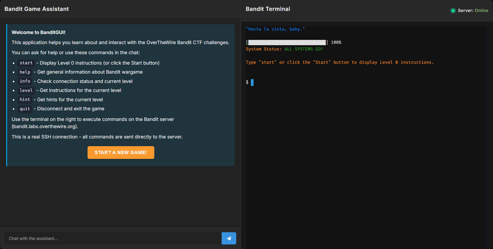
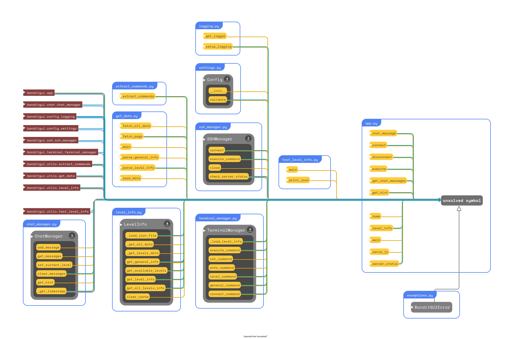

# v0.3 -BanditGUI : Making Cybersecurity Learning Accessible



*A web-based interface for the popular OverTheWire Bandit wargame that brings terminal access, structured learning, and helpful hints to your browser.*

## The Challenge of Learning Cybersecurity

Learning cybersecurity can be intimidating. Between complex terminology, command-line interfaces, and the need for specialized environments, many beginners find themselves overwhelmed before they even start. The OverTheWire Bandit wargame is an excellent resource for beginners, but it still requires SSH access and command-line knowledge that can create barriers to entry.

That's where BanditGUI comes in.

## What is BanditGUI?

BanditGUI is an open-source web application that provides a user-friendly interface to the OverTheWire Bandit wargame. It combines a full-featured terminal emulator with a helpful chat assistant, allowing users to:

- Connect to the Bandit server directly from their browser
- Execute commands in a real SSH terminal
- Access level-specific information and hints
- Track their progress through the challenges
- Learn Linux commands and security concepts in a structured way

With BanditGUI, we're removing the barriers to entry for cybersecurity education, making it accessible to anyone with a web browser.

## Key Features in v0.3

The v0.3 release of BanditGUI brings several significant improvements:

### 1. Full-Featured Terminal Experience

We've implemented xterm.js, a powerful terminal emulator for the web, providing:

- A responsive and interactive terminal interface
- Support for ANSI color codes for better visual feedback
- Command history navigation with arrow keys
- Automatic terminal resizing with the FitAddon
- Clickable URLs in terminal output with the WebLinksAddon

### 2. Real SSH Connections

BanditGUI establishes actual SSH connections to the Bandit server, allowing users to:

- Execute real Linux commands
- Experience authentic terminal interactions
- Learn in a realistic environment
- Receive immediate feedback on their commands

#### SSH Connection Flow


*The diagram shows how user commands flow through the application components to the SSH server and back.*

The SSH implementation uses Paramiko to establish secure connections with password authentication. Commands entered in the terminal are sent to the SSH server via the SSHManager, with comprehensive error handling and logging throughout the process.

### 3. Modular Architecture

The application features a completely refactored codebase with:

- Clear separation of concerns through dedicated manager classes
- Improved code organization with descriptive file names
- Well-documented code with comprehensive docstrings
- A clean, maintainable structure for future development

### 4. Level Information System

Users can access detailed information about each Bandit level:

- Level-specific goals and objectives
- Suggested commands with links to documentation
- Helpful reading materials and resources
- A structured approach to progressing through the challenges

### 5. Chat Interface

The application includes a chat interface that:

- Provides helpful hints for each level
- Responds to basic commands like 'help', 'info', and 'level'
- Offers a user-friendly way to access information
- Creates a more interactive learning experience

## Technical Implementation

BanditGUI is built with modern web technologies:

- **Backend**: Python with Flask for the web server
- **Frontend**: HTML, CSS, and JavaScript
- **Terminal**: xterm.js with FitAddon and WebLinksAddon
- **SSH**: Paramiko for secure SSH connections
- **Data**: JSON-based storage for level information

The application follows good software engineering practices:

- Modular design with clear separation of concerns
- Comprehensive error handling
- Detailed logging
- Well-documented code
- Clean, maintainable structure

## Roadmap for Future Development

We have exciting plans for future versions of BanditGUI:

1. **Password Management**: Adding secure password storage with encryption
2. **Progress Tracking**: Implementing a system to track user progress through the challenges
3. **Gamification**: Adding badges, streaks, and other gamification elements to increase engagement
4. **Advanced Terminal Features**: Adding syntax highlighting, command suggestions, and improved output formatting
5. **Accessibility Improvements**: Ensuring proper contrast ratios, keyboard navigation, and screen reader compatibility

## Getting Started

Ready to try BanditGUI? Installation is now easier than ever with our automated installation scripts!

### Automatic Installation

#### Windows

1. Double-click on `install.bat`
2. Follow the on-screen instructions
3. After installation, run `run.bat` to start the application

#### Linux/macOS

1. Open a terminal in the project directory

2. Make the installation script executable:

   ```bash
   chmod +x install.sh
   ```

3. Run the installation script:

   ```bash
   ./install.sh
   ```

4. After installation, run the application:

   ```bash
   ./run.sh
   ```

### Manual Installation

If you prefer to install manually:

1. Clone the repository:

   ```bash
   git clone https://github.com/therealfredp3D/Making-BanditGUI.git
   cd Making-BanditGUI
   ```

2. Create and activate a virtual environment:

   ```bash
   # Windows
   python -m venv venv
   venv\Scripts\activate

   # Linux/macOS
   python3 -m venv venv
   source venv/bin/activate
   ```

3. Install Python dependencies:

   ```bash
   pip install -r requirements.txt
   ```

4. Install Node.js dependencies:

   ```bash
   npm install
   ```

5. Start the application:

   ```bash
   python -m banditgui.app
   ```

For more detailed installation instructions, see [INSTALL.md](INSTALL.md).

## New in v0.3

### Improved Installation Process

The v0.3 release introduces automated installation scripts that make it easier than ever to get started with BanditGUI:

- **Cross-platform support**: Installation scripts for both Windows and Unix-like systems
- **Dependency management**: Automatic installation of all required dependencies
- **Environment setup**: Creation of virtual environments and configuration files
- **Clear instructions**: Step-by-step guidance throughout the installation process

### UI Improvements

- Updated color palette to be more modern and readable with better contrast
- Added a 'Start a New Game!' button instead of automatically displaying level 0 information
- Improved chat log management with automatic clearing before showing level information
- Better initial display showing only Level Name/Goal/Commands/Reading Material
- Made hints available only via the 'hint' command
- Added margin to the terminal display to prevent text from being hidden
- Implemented fixed 50/50 split between chat and terminal panels for better usability
- Enhanced SSH connection handling with clear success messages
- Improved transition between levels with automatic display of next level information
- Made all help messages and instructions consistent throughout the application

## Conclusion

BanditGUI v0.3 represents a significant step forward in making cybersecurity education more accessible. By combining a powerful terminal emulator with helpful guidance, a structured learning approach, an improved installation process, and now a more modern and user-friendly interface, we're removing barriers to entry and creating a more engaging learning experience.

The updated color palette, improved navigation, enhanced feedback, and consistent user experience make BanditGUI more intuitive and enjoyable to use. The smoother transitions between levels and clearer instructions help users focus on learning rather than figuring out how to use the application.

Whether you're a complete beginner looking to learn Linux commands, a student studying cybersecurity, or an educator teaching security concepts, BanditGUI provides a valuable tool for your journey.

Try BanditGUI today and start your cybersecurity learning adventure!

---

BanditGUI is an open-source project dedicated to me, learning some new things. It's just a personal pet project made by a novice hobyist developer. Don't be to hard judging the thing.I am having fun learning as I work on it.

If you have any questions or feedback, please don't hesitate to reach out.

---

> Frederick Pellerin
>
><fredp3d@proton.me>
>[GitHub](https://github.com/therealfredp3D)
>[X](https://x.com/therealfredp3D)

---


