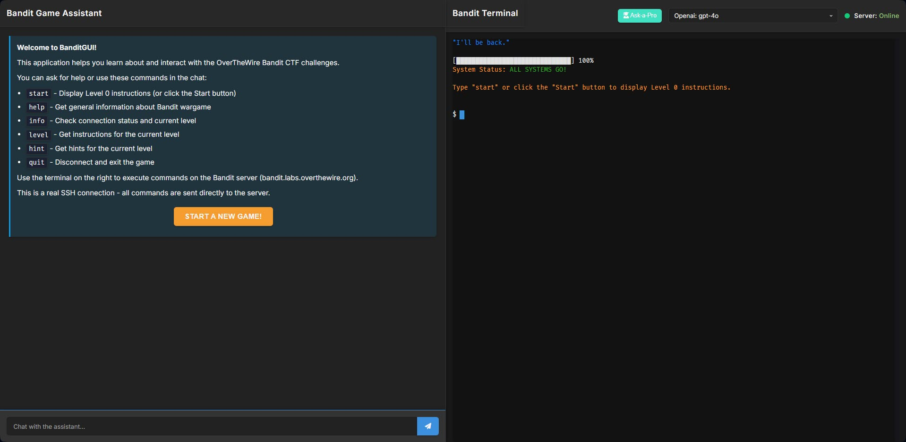
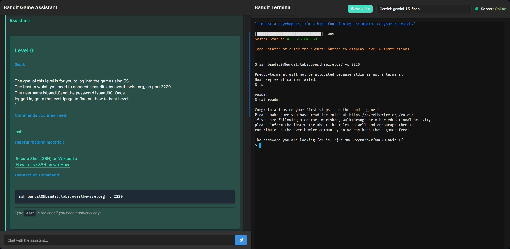
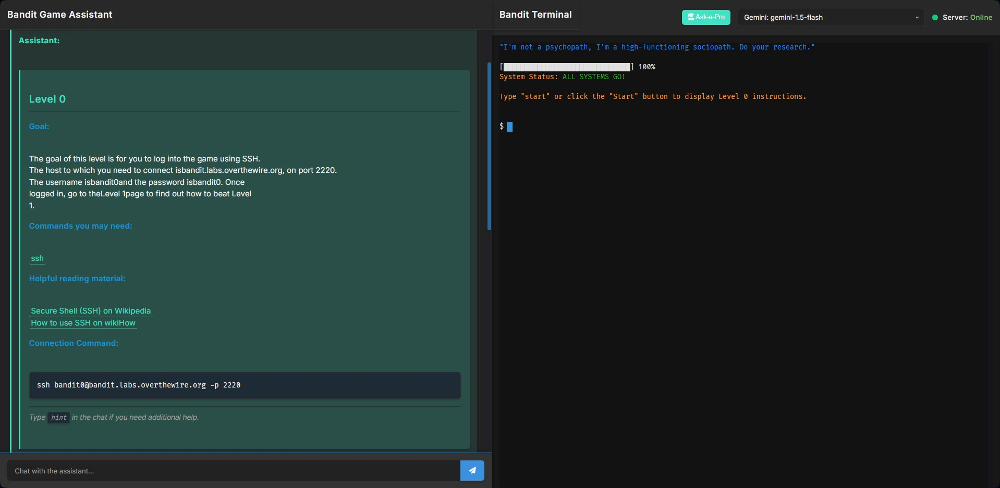
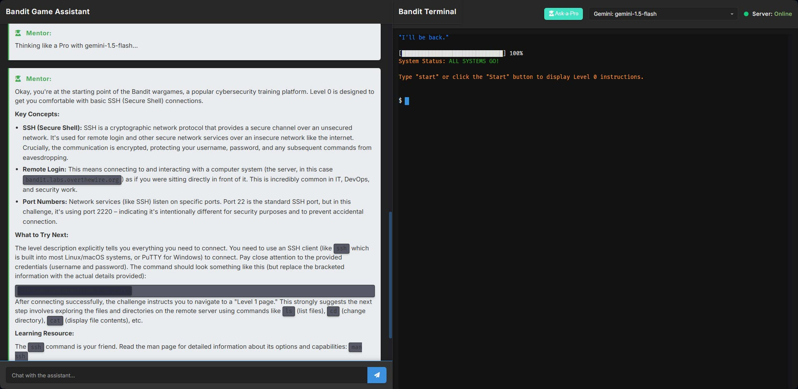
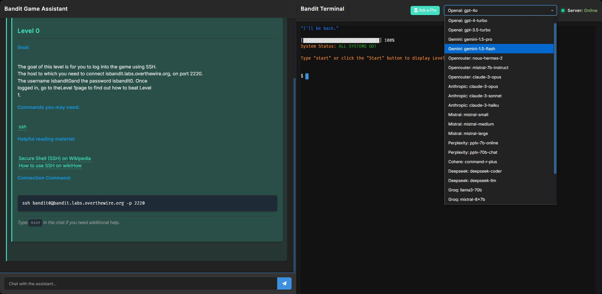

# v0.4 - BanditGUI: Making Cybersecurity Learning Accessible



BanditGUI is a web-based interface for the popular OverTheWire Bandit wargame. It aims to make learning cybersecurity fundamentals more approachable by providing a browser-based terminal, structured level information, and an AI-powered assistant.

## Why BanditGUI?

The command-line nature of challenges like Bandit can be a hurdle for beginners. BanditGUI lowers this barrier by:

* Providing an integrated terminal in your browser.
* Offering easy access to level goals, commands, and learning resources.
* Assisting with hints and explanations through an AI chat interface.

## Core Features

* **Interactive Web Terminal:** A full-featured xterm.js terminal in your browser to connect to Bandit via SSH.  



* **Real SSH Connections:** Practice with actual Linux commands in a realistic environment.

* **Level Guidance:** Access information, relevant commands, and reading materials for each Bandit level.



* **AI-Powered Chat Assistant:** Get intelligent hints and explanations from an LLM-powered chat (supports various models via LiteLLM).



* **Simplified Setup:** Easy installation using a Python script.
* **Modular Design:** Built with a maintainable Python Flask backend and JavaScript frontend.

## Tech Stack

* **Backend:** Python (Flask)
* **Frontend:** HTML, CSS, JavaScript (xterm.js)
* **SSH:** Paramiko
* **LLM Integration:** LiteLLM  



## Getting Started

### Installation

1. **Clone the repository:**

    ```bash
    git clone https://github.com/therealfredp3D/Making-BanditGUI.git
    cd Making-BanditGUI
    ```

2. **Run the installation script:**
    This script will set up a virtual environment, install dependencies, and create run scripts.

    ```bash
    python install.py
    # or python3 install.py on some systems
    ```

3. **Follow on-screen instructions.** The script will guide you through any necessary checks.

### Running BanditGUI

* **Windows:** Execute `run.bat` (Generated by `install.py`)
* **Linux/macOS:** Execute `./run.sh` (Generated by `install.py`)

Once started, the application is typically available at `http://127.0.0.1:5000`.

## How to Contribute

We welcome contributions! Please follow these general steps:

1. Fork the repository.
2. Create a new branch for your feature or bug fix.
3. Make your changes.
4. Test your changes thoroughly.
5. Commit your changes with a clear message.
6. Open a Pull Request to the `main` branch.

## Roadmap Highlights

We are continuously working to improve BanditGUI. Some of our future goals include:

1. **Password Management**: Adding secure password storage with encryption
2. **Progress Tracking**: Implementing a system to track user progress through the challenges
3. **Gamification**: Adding badges, streaks, and other gamification elements to increase engagement

## License

This project is licensed under the MIT License.

### 5. LLM-Powered Chat Interface

The application includes an advanced chat interface powered by Large Language Models (LLMs). It leverages `litellm` to support various API providers and LLM, making it easy to switch between different models.

For more detailed installation instructions, see [installation guide](docs/notion/notion_installation_guide.md).

## New in v0.4
