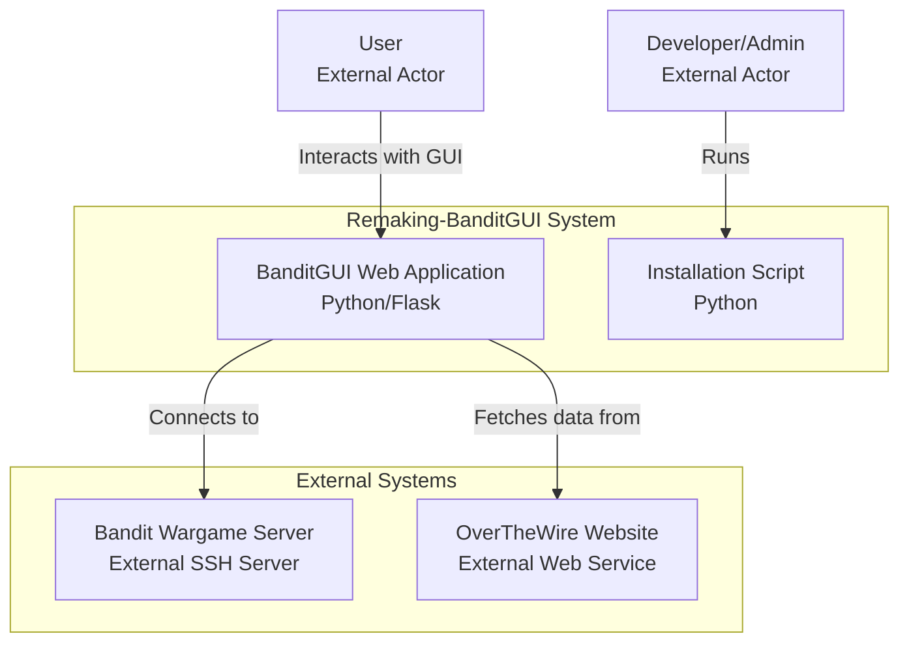

# System Context

## I am working on a software system with the following directory structure, architecture, and analyzed files

## Directory Structure

```
Remaking-BanditGUI
├── banditgui
│   ├── chat
│   │   ├── __init__.py
│   │   └── chat_manager.py
│   ├── config
│   │   ├── __init__.py
│   │   ├── logging.py
│   │   └── settings.py
│   ├── data
│   │   ├── all_data.json
│   │   ├── commands_data.json
│   │   ├── geek_quotes.json
│   │   ├── general_info.json
│   │   ├── levels_info.json
│   │   ├── README.md
│   │   └── tldr-pages-book.pdf
│   ├── ssh
│   │   ├── __init__.py
│   │   └── ssh_manager.py
│   ├── static
│   │   ├── js
│   │   │   ├── bandit-app.js
│   │   │   ├── bandit-terminal.js
│   │   │   ├── quote-manager.js
│   │   │   ├── xterm-addon-fit.js
│   │   │   ├── xterm-addon-web-links.js
│   │   │   ├── xterm-bandit-terminal.js
│   │   │   └── xterm.js
│   │   ├── bandit-terminal.css
│   │   ├── xterm-custom.css
│   │   └── xterm.css
│   ├── templates
│   │   └── index.html
│   ├── terminal
│   │   ├── __init__.py
│   │   └── terminal_manager.py
│   ├── utils
│   │   ├── __init__.py
│   │   ├── extract_commands.py
│   │   ├── get_data.py
│   │   ├── level_info.py
│   │   ├── quotes.py
│   │   └── test_level_info.py
│   ├── __init__.py
│   ├── app.py
│   └── exceptions.py
├── docs
│   ├── assets
│   │   ├── BanditGUI-Badge.jpg
│   │   ├── favicon.ico
│   │   ├── generated-icon.png
│   │   ├── head-pixel.png
│   │   ├── head-title.png
│   │   ├── need_a_hand.gif
│   │   ├── quote.md
│   │   ├── v0.1-Diagram-full.jpg
│   │   ├── v0.1-Diagram-min.jpg
│   │   ├── v0.2-screenshot.jpg
│   │   ├── v0.3-Min-Overview.jpg
│   │   ├── v0.3-Overview.jpg
│   │   ├── v0.3-screenshot.jpg
│   │   └── v0.3-Sourcetrail.png
│   ├── drawio
│   │   ├── v0.2-Detailled-Overview.drawio
│   │   ├── v0.3-Chat-Flow.drawio
│   │   ├── v0.3-Detailled-Overview.drawio
│   │   ├── v0.3-Min-Overview.drawio
│   │   ├── v0.3-SSH-Flow-Detailed .md
│   │   ├── v0.3-SSH-Flow-Detailed.drawio
│   │   └── v0.3-SSH-Flow.drawio
│   ├── notion
│   │   ├── notion_development_notes.md
│   │   ├── notion_features_overview.md
│   │   ├── notion_homepage.md
│   │   ├── notion_installation_guide.md
│   │   ├── notion_project_documentation.md
│   │   ├── notion_roadmap.md
│   │   └── notion_screenshots_media.md
│   ├── promo
│   │   ├── blog.md
│   │   ├── notion_update.md
│   │   ├── presentation.md
│   │   └── shorts.md
│   ├── Extra-Learning.md
│   ├── v0.1-Prototype.md
│   ├── v0.2-FINAL-Components-dev.md
│   ├── v0.2-FINAL-Overview.md
│   ├── v0.3-Chat-Flow.md
│   ├── v0.3-Min-Overview.md
│   ├── v0.3-Overview.md
│   └── v0.3-SSH-Flow.md
├── static
│   ├── js
│   │   ├── xterm-addon-fit.js
│   │   ├── xterm-addon-web-links.js
│   │   └── xterm.js
│   └── xterm.css
├── icon.png
├── install.bat
├── INSTALL.md
├── install.py
├── install.sh
├── package-lock.json
├── package.json
├── README.md
├── requirements.txt
├── run.sh
├── v0.3--FINAL-Overview.md
├── v0.3-FINAL-Review.md
├── v0.3-ROADMAP.md
└── v0.3.1-context.md

```

## Mermaid Diagram



## Analyzed Files
