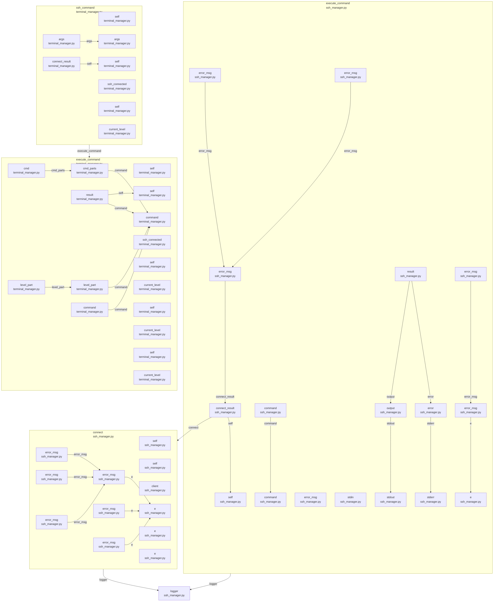

```mermaid
graph TD

    3314["logger<br>ssh_manager.py"]
    subgraph 3317["connect<br>ssh_manager.py"]
        3324["self<br>ssh_manager.py"]
        3326["client<br>ssh_manager.py"]
        3325["self<br>ssh_manager.py"]
        3327["e<br>ssh_manager.py"]
        3328["error_msg<br>ssh_manager.py"]
        3329["error_msg<br>ssh_manager.py"]
        3330["e<br>ssh_manager.py"]
        3331["error_msg<br>ssh_manager.py"]
        3332["error_msg<br>ssh_manager.py"]
        3333["e<br>ssh_manager.py"]
        3334["error_msg<br>ssh_manager.py"]
        3335["error_msg<br>ssh_manager.py"]
        %% Edges at this level (grouped by source)
        3328["error_msg<br>ssh_manager.py"] -->|e| 3327["e<br>ssh_manager.py"]
        3331["error_msg<br>ssh_manager.py"] -->|e| 3327["e<br>ssh_manager.py"]
        3334["error_msg<br>ssh_manager.py"] -->|e| 3327["e<br>ssh_manager.py"]
        3329["error_msg<br>ssh_manager.py"] -->|error_msg| 3328["error_msg<br>ssh_manager.py"]
        3332["error_msg<br>ssh_manager.py"] -->|error_msg| 3328["error_msg<br>ssh_manager.py"]
        3335["error_msg<br>ssh_manager.py"] -->|error_msg| 3328["error_msg<br>ssh_manager.py"]
    end
    subgraph 3318["execute_command<br>ssh_manager.py"]
        3337["command<br>ssh_manager.py"]
        3336["self<br>ssh_manager.py"]
        3338["connect_result<br>ssh_manager.py"]
        3339["error_msg<br>ssh_manager.py"]
        3340["error_msg<br>ssh_manager.py"]
        3341["error_msg<br>ssh_manager.py"]
        3342["error_msg<br>ssh_manager.py"]
        3346["command<br>ssh_manager.py"]
        3345["stderr<br>ssh_manager.py"]
        3343["stdin<br>ssh_manager.py"]
        3344["stdout<br>ssh_manager.py"]
        3347["output<br>ssh_manager.py"]
        3348["error<br>ssh_manager.py"]
        3349["result<br>ssh_manager.py"]
        3350["e<br>ssh_manager.py"]
        3351["error_msg<br>ssh_manager.py"]
        3352["error_msg<br>ssh_manager.py"]
        %% Edges at this level (grouped by source)
        3338["connect_result<br>ssh_manager.py"] -->|self| 3336["self<br>ssh_manager.py"]
        3346["command<br>ssh_manager.py"] -->|command| 3337["command<br>ssh_manager.py"]
        3339["error_msg<br>ssh_manager.py"] -->|connect_result| 3338["connect_result<br>ssh_manager.py"]
        3340["error_msg<br>ssh_manager.py"] -->|error_msg| 3339["error_msg<br>ssh_manager.py"]
        3342["error_msg<br>ssh_manager.py"] -->|error_msg| 3339["error_msg<br>ssh_manager.py"]
        3347["output<br>ssh_manager.py"] -->|stdout| 3344["stdout<br>ssh_manager.py"]
        3348["error<br>ssh_manager.py"] -->|stderr| 3345["stderr<br>ssh_manager.py"]
        3349["result<br>ssh_manager.py"] -->|output| 3347["output<br>ssh_manager.py"]
        3349["result<br>ssh_manager.py"] -->|error| 3348["error<br>ssh_manager.py"]
        3351["error_msg<br>ssh_manager.py"] -->|e| 3350["e<br>ssh_manager.py"]
        3352["error_msg<br>ssh_manager.py"] -->|error_msg| 3351["error_msg<br>ssh_manager.py"]
    end
    subgraph 1696["execute_command<br>terminal_manager.py"]
        1725["command<br>terminal_manager.py"]
        1724["self<br>terminal_manager.py"]
        1726["cmd_parts<br>terminal_manager.py"]
        1727["cmd<br>terminal_manager.py"]
        1728["result<br>terminal_manager.py"]
        1729["self<br>terminal_manager.py"]
        1730["ssh_connected<br>terminal_manager.py"]
        1731["level_part<br>terminal_manager.py"]
        1733["current_level<br>terminal_manager.py"]
        1734["level_part<br>terminal_manager.py"]
        1732["self<br>terminal_manager.py"]
        1736["current_level<br>terminal_manager.py"]
        1735["self<br>terminal_manager.py"]
        1738["current_level<br>terminal_manager.py"]
        1737["self<br>terminal_manager.py"]
        1739["command<br>terminal_manager.py"]
        %% Edges at this level (grouped by source)
        1726["cmd_parts<br>terminal_manager.py"] -->|command| 1725["command<br>terminal_manager.py"]
        1728["result<br>terminal_manager.py"] -->|self| 1729["self<br>terminal_manager.py"]
        1728["result<br>terminal_manager.py"] -->|command| 1725["command<br>terminal_manager.py"]
        1731["level_part<br>terminal_manager.py"] -->|command| 1725["command<br>terminal_manager.py"]
        1739["command<br>terminal_manager.py"] -->|command| 1725["command<br>terminal_manager.py"]
        1727["cmd<br>terminal_manager.py"] -->|cmd_parts| 1726["cmd_parts<br>terminal_manager.py"]
        1734["level_part<br>terminal_manager.py"] -->|level_part| 1731["level_part<br>terminal_manager.py"]
    end
    subgraph 1700["ssh_command<br>terminal_manager.py"]
        1747["args<br>terminal_manager.py"]
        1746["self<br>terminal_manager.py"]
        1748["connect_result<br>terminal_manager.py"]
        1749["self<br>terminal_manager.py"]
        1750["ssh_connected<br>terminal_manager.py"]
        1752["current_level<br>terminal_manager.py"]
        1751["self<br>terminal_manager.py"]
        1753["args<br>terminal_manager.py"]
        %% Edges at this level (grouped by source)
        1753["args<br>terminal_manager.py"] -->|args| 1747["args<br>terminal_manager.py"]
        1748["connect_result<br>terminal_manager.py"] -->|self| 1749["self<br>terminal_manager.py"]
    end
    %% Edges at this level (grouped by source)
    1700["ssh_command<br>terminal_manager.py"] -->|execute_command| 1696["execute_command<br>terminal_manager.py"]
    3338["connect_result<br>ssh_manager.py"] -->|connect| 3317["connect<br>ssh_manager.py"]
    3318["execute_command<br>ssh_manager.py"] -->|logger| 3314["logger<br>ssh_manager.py"]
    3317["connect<br>ssh_manager.py"] -->|logger| 3314["logger<br>ssh_manager.py"]
```
