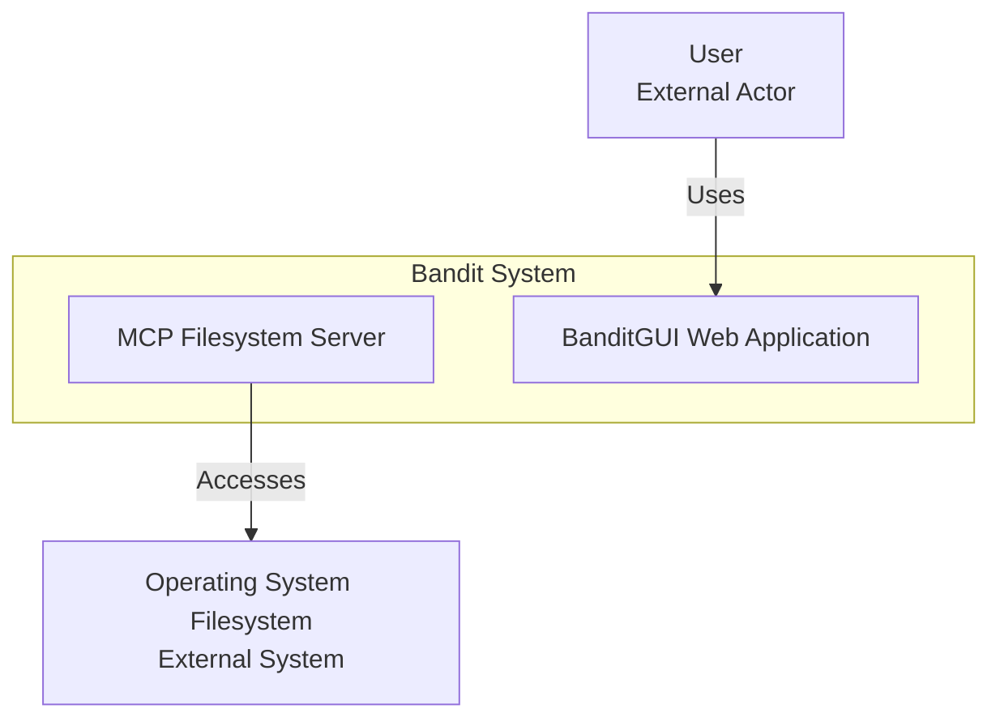
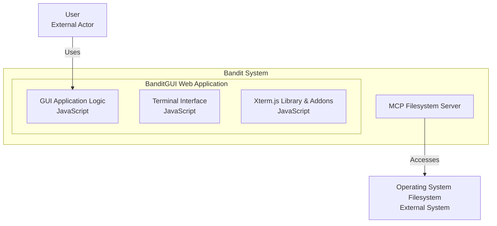

# v0.2-FINAL - BanditGUI

## Summary
  
**Nermaid Code**  
  
> Note that the `MCP Filesystem Server` is only use for development and is not part of the final product.
  

  
---
  
## Full View  
  
> Note that the `MCP Filesystem Server` is only use for development and is not part of the final product.
  

