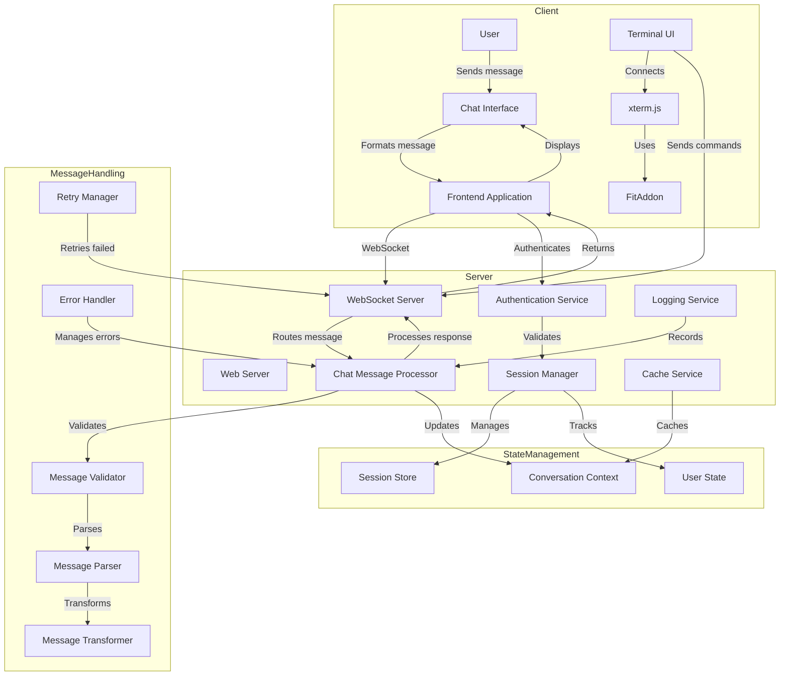

# v0.3 - BanditGUI Chat Flow

```mermaid
graph TD
    subgraph Client
        user[User]
        frontend[Frontend Application]
        chatUI[Chat Interface]
        terminal[Terminal UI]
        xterm[xterm.js]
        fitAddon[FitAddon]
    end

    subgraph Server
        webServer[Web Server]
        wsServer[WebSocket Server]
        sessionMgr[Session Manager]
        chatProcessor[Chat Message Processor]
        authService[Authentication Service]
        cacheService[Cache Service]
        logger[Logging Service]
    end

    subgraph MessageHandling
        validator[Message Validator]
        parser[Message Parser]
        transformer[Message Transformer]
        errorHandler[Error Handler]
        retryMgr[Retry Manager]
    end

    subgraph StateManagement 
        contextStore[Conversation Context]
        sessionStore[Session Store]
        userState[User State]
    end

    
    user -->|Sends message| chatUI
    chatUI -->|Formats message| frontend
    frontend -->|WebSocket| wsServer
    wsServer -->|Routes message| chatProcessor
    chatProcessor -->|Validates| validator
    validator -->|Parses| parser
    parser -->|Transforms| transformer

    
    chatProcessor -->|Updates| contextStore
    sessionMgr -->|Manages| sessionStore
    sessionMgr -->|Tracks| userState

    
    terminal -->|Connects| xterm
    xterm -->|Uses| fitAddon
    terminal -->|Sends commands| wsServer

    
    errorHandler -->|Manages errors| chatProcessor
    retryMgr -->|Retries failed| wsServer

    
    frontend -->|Authenticates| authService
    authService -->|Validates| sessionMgr

    
    cacheService -->|Caches| contextStore
    logger -->|Records| chatProcessor

    
    chatProcessor -->|Processes response| wsServer
    wsServer -->|Returns| frontend
    frontend -->|Displays| chatUI
```
