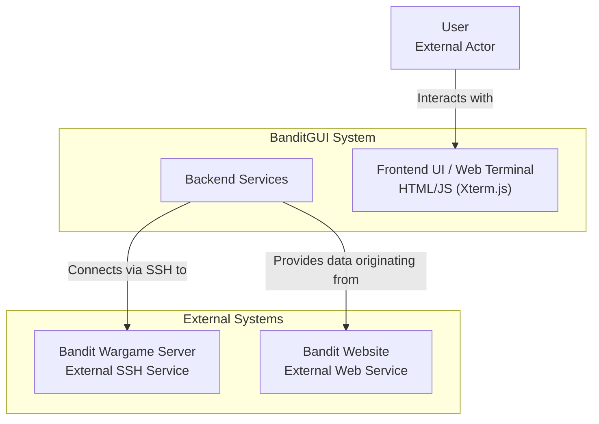

# v0.3 - BanditGUI Overview

```mermaid
graph TD

    45493["User<br>External Actor"]
    subgraph 45490["BanditGUI System"]
        45491["Backend Services"]
        45496["Frontend UI / Web Terminal<br>HTML/JS (Xterm.js)"]
    end
    subgraph 45492["External Systems"]
        45494["Bandit Wargame Server<br>External SSH Service"]
        45495["Bandit Website<br>External Web Service"]
    end
    %% Edges at this level (grouped by source)
    45493["User<br>External Actor"] -->|Interacts with| 45496["Frontend UI / Web Terminal<br>HTML/JS (Xterm.js)"]
    45491["Backend Services"] -->|Connects via SSH to| 45494["Bandit Wargame Server<br>External SSH Service"]
    45491["Backend Services"] -->|Provides data originating from| 45495["Bandit Website<br>External Web Service"]
```
