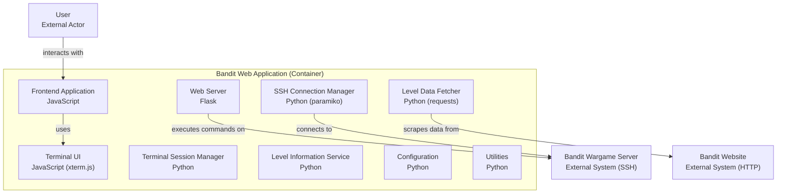

# 0.3 - BanditGUI Overview

```mermaid
graph TD
    44601["User<br>External Actor"]
    44602["Bandit Wargame Server<br>External System (SSH)"]
    44603["Bandit Website<br>External System (HTTP)"]
    subgraph 44600["Bandit Web Application (Container)"]
        44604["Web Server<br>Flask"]
        44605["Frontend Application<br>JavaScript"]
        44606["Terminal UI<br>JavaScript (xterm.js)"]
        44607["SSH Connection Manager<br>Python (paramiko)"]
        44608["Terminal Session Manager<br>Python"]
        44609["Level Information Service<br>Python"]
        44610["Configuration<br>Python"]
        44611["Utilities<br>Python"]
        44612["Level Data Fetcher<br>Python (requests)"]
        %% Edges at this level (grouped by source)
        44605["Frontend Application<br>JavaScript"] -->|uses| 44606["Terminal UI<br>JavaScript (xterm.js)"]
    end
    %% Edges at this level (grouped by source)
    44604["Web Server<br>Flask"] -->|executes commands on| 44602["Bandit Wargame Server<br>External System (SSH)"]
    44607["SSH Connection Manager<br>Python (paramiko)"] -->|connects to| 44602["Bandit Wargame Server<br>External System (SSH)"]
    44612["Level Data Fetcher<br>Python (requests)"] -->|scrapes data from| 44603["Bandit Website<br>External System (HTTP)"]
    44601["User<br>External Actor"] -->|interacts with| 44605["Frontend Application<br>JavaScript"]
```
