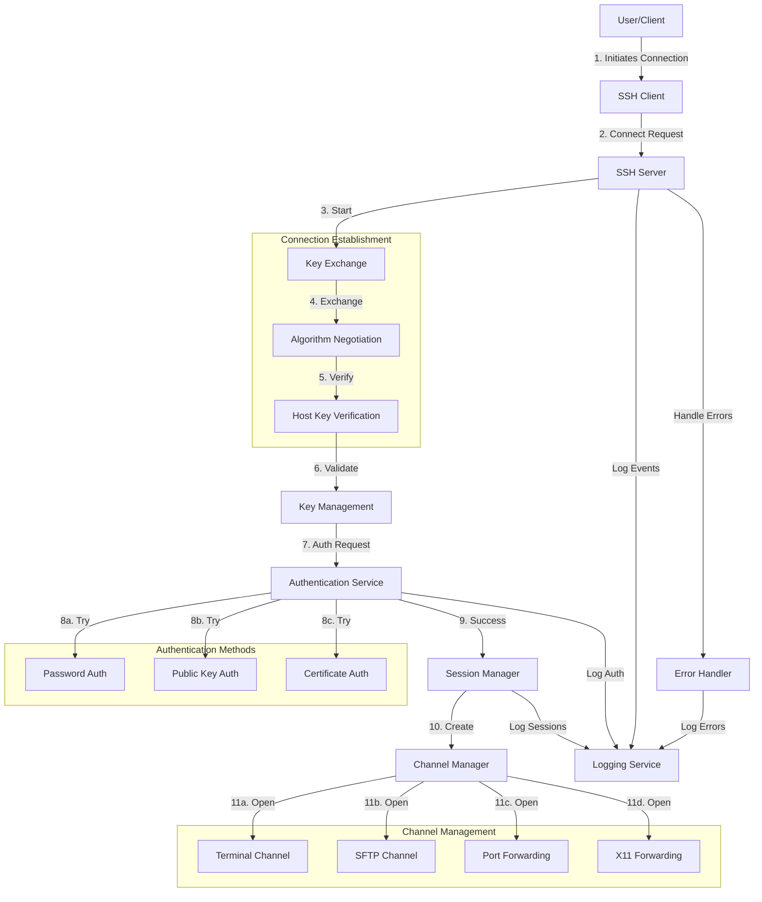

# v0.3 - BanditGUI SSH Flow

```mermaid
graph TD
    
    User["User/Client"]
    SSHClient["SSH Client"]
    SSHServer["SSH Server"]
    AuthService["Authentication Service"]
    KeyManager["Key Management"]
    SessionMgr["Session Manager"]
    ChannelMgr["Channel Manager"]
    Logger["Logging Service"]
    ErrorHandler["Error Handler"]

    
    subgraph "Connection Establishment"
        KeyExchange["Key Exchange"]
        AlgoNegotiation["Algorithm Negotiation"]
        HostKeyVerify["Host Key Verification"]
    end

    subgraph "Authentication Methods"
        Password["Password Auth"]
        PublicKey["Public Key Auth"]
        Certificate["Certificate Auth"]
    end

    subgraph "Channel Management"
        Terminal["Terminal Channel"]
        SFTP["SFTP Channel"]
        PortFwd["Port Forwarding"]
        X11["X11 Forwarding"]
    end

    
    User -->|"1. Initiates Connection"| SSHClient
    SSHClient -->|"2. Connect Request"| SSHServer
    SSHServer -->|"3. Start"| KeyExchange
    KeyExchange -->|"4. Exchange"| AlgoNegotiation
    AlgoNegotiation -->|"5. Verify"| HostKeyVerify
    HostKeyVerify -->|"6. Validate"| KeyManager

    
    KeyManager -->|"7. Auth Request"| AuthService
    AuthService -->|"8a. Try"| Password
    AuthService -->|"8b. Try"| PublicKey
    AuthService -->|"8c. Try"| Certificate

    
    AuthService -->|"9. Success"| SessionMgr
    SessionMgr -->|"10. Create"| ChannelMgr
    ChannelMgr -->|"11a. Open"| Terminal
    ChannelMgr -->|"11b. Open"| SFTP
    ChannelMgr -->|"11c. Open"| PortFwd
    ChannelMgr -->|"11d. Open"| X11

    
    SSHServer -->|"Log Events"| Logger
    SSHServer -->|"Handle Errors"| ErrorHandler
    AuthService -->|"Log Auth"| Logger
    SessionMgr -->|"Log Sessions"| Logger
    ErrorHandler -->|"Log Errors"| Logger
```
