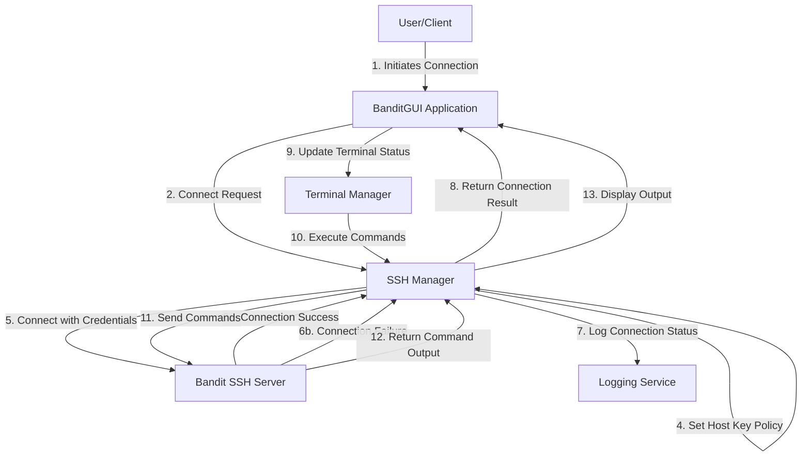

# v0.3 - BanditGUI SSH Flow

## Overview

The BanditGUI application uses Paramiko to establish SSH connections to the OverTheWire Bandit server. This document outlines the simplified SSH flow as implemented in the application.

## SSH Connection Flow

## Implementation Details

- **Authentication**: BanditGUI uses password authentication with the Bandit server
- **Command Execution**: Commands entered in the terminal are sent to the SSH server via the SSHManager
- **Error Handling**: Connection and command execution errors are logged and displayed to the user
- **Auto-Connection**: Some commands (like SSH commands) will attempt to auto-connect if not already connected

## Key Components

- **SSHManager**: Handles SSH connections and command execution
- **TerminalManager**: Manages terminal interactions and forwards commands to SSHManager
- **Configuration**: SSH connection details are stored in environment variables
