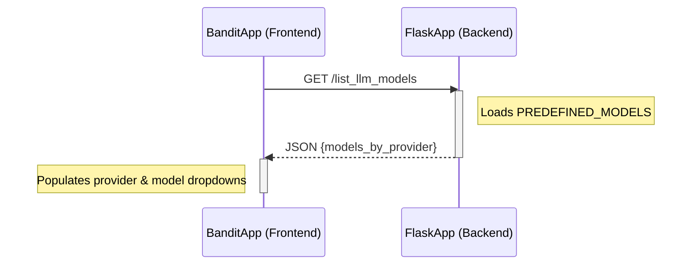
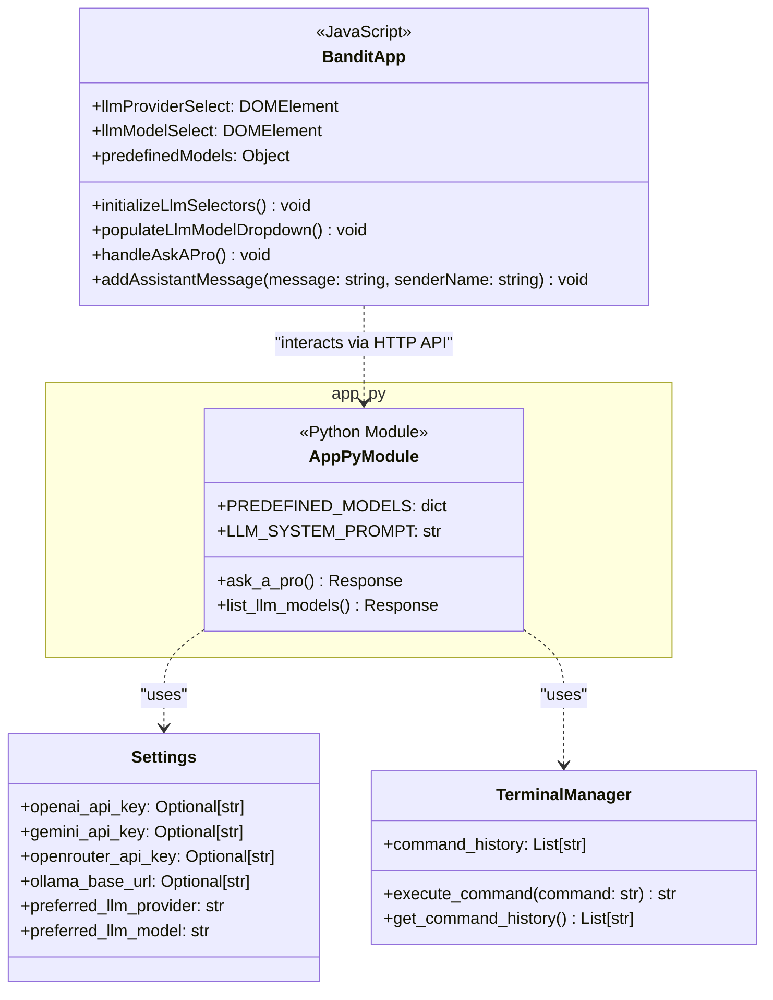

# LLM - Diagrams

## Sequence Diagram for Initializing LLM Selectors

```mermaid
sequenceDiagram
    participant BA as BanditApp (Frontend)
    participant FA as FlaskApp (Backend)

    BA->>FA: GET /list_llm_models
    activate FA
    Note right of FA: Loads PREDEFINED_MODELS
    FA-->>BA: JSON {models_by_provider}
    deactivate FA
    activate BA
    Note left of BA: Populates provider & model dropdowns
    deactivate BA
```

## Class Diagram for Updated Components

```mermaid
classDiagram
    class Settings {
        +openai_api_key: Optional[str]
        +gemini_api_key: Optional[str]
        +openrouter_api_key: Optional[str]
        +ollama_base_url: Optional[str]
        +preferred_llm_provider: str
        +preferred_llm_model: str
    }

    class TerminalManager {
        +command_history: List[str]
        +execute_command(command: str) str
        +get_command_history() List[str]
    }

    class BanditApp {
        <<JavaScript>>
        +llmProviderSelect: DOMElement
        +llmModelSelect: DOMElement
        +predefinedModels: Object
        +initializeLlmSelectors() void
        +populateLlmModelDropdown() void
        +handleAskAPro() void
        +addAssistantMessage(message: string, senderName: string) void
    }

    namespace app_py {
        class AppPyModule {
            <<Python Module>>
            +PREDEFINED_MODELS: dict
            +LLM_SYSTEM_PROMPT: str
            +ask_a_pro() Response
            +list_llm_models() Response
        }
    }

    AppPyModule ..> Settings : "uses"
    AppPyModule ..> TerminalManager : "uses"
    BanditApp ..> AppPyModule : "interacts via HTTP API"
```