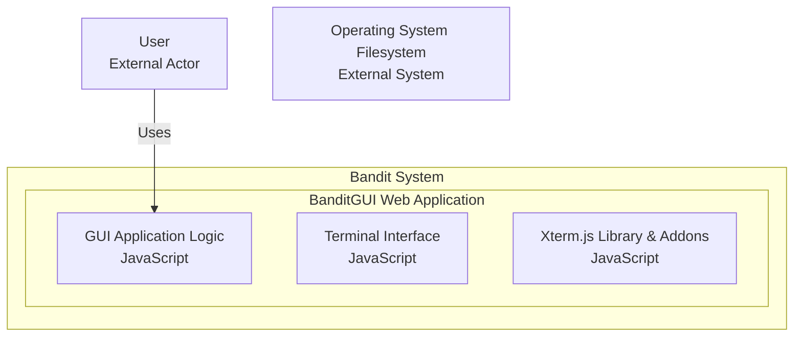

# System Context

## I am working on a software system with the following directory structure, architecture, and analyzed files

## Directory Structure

```
├── .gitignore
├── .mcp-servers
│   ├── ._DEV_NOTES
│   │   └── SUMMARY-mcp-server-filesystem.md
│   ├── .augmentignore
│   ├── .gitignore
│   ├── MCP-Python-SDK
│   │   └── python-sdk-main
│   │       ├── .git-blame-ignore-revs
│   │       ├── .github
│   │       │   ├── ISSUE_TEMPLATE
│   │       │   │   ├── bug_report.md
│   │       │   │   └── feature_request.md
│   │       │   └── workflows
│   │       │       ├── check-lock.yml
│   │       │       ├── main-checks.yml
│   │       │       ├── publish-docs-manually.yml
│   │       │       ├── publish-pypi.yml
│   │       │       ├── pull-request-checks.yml
│   │       │       └── shared.yml
│   │       ├── .gitignore
│   │       ├── .pre-commit-config.yaml
│   │       ├── CLAUDE.md
│   │       ├── CODE_OF_CONDUCT.md
│   │       ├── CONTRIBUTING.md
│   │       ├── README.md
│   │       ├── RELEASE.md
│   │       ├── SECURITY.md
│   │       ├── docs
│   │       │   ├── api.md
│   │       │   └── index.md
│   │       ├── examples
│   │       │   ├── README.md
│   │       │   ├── clients
│   │       │   │   └── simple-chatbot
│   │       │   │       ├── .python-version
│   │       │   │       ├── README.MD
│   │       │   │       ├── mcp_simple_chatbot
│   │       │   │       │   ├── .env.example
│   │       │   │       │   ├── requirements.txt
│   │       │   │       │   ├── servers_config.json
│   │       │   │       │   └── test.db
│   │       │   │       ├── pyproject.toml
│   │       │   │       └── uv.lock
│   │       │   └── servers
│   │       │       ├── simple-prompt
│   │       │       │   ├── .python-version
│   │       │       │   ├── README.md
│   │       │       │   └── pyproject.toml
│   │       │       ├── simple-resource
│   │       │       │   ├── .python-version
│   │       │       │   ├── README.md
│   │       │       │   └── pyproject.toml
│   │       │       └── simple-tool
│   │       │           ├── .python-version
│   │       │           ├── README.md
│   │       │           └── pyproject.toml
│   │       ├── mkdocs.yml
│   │       ├── pyproject.toml
│   │       ├── src
│   │       │   └── mcp
│   │       │       └── py.typed
│   │       └── uv.lock
│   ├── README.md
│   ├── docs
│   │   └── v0.1-Final-review.md
│   ├── mcp_demo_filesystem.py
│   ├── mcp_filesystem_server.py
│   └── test_mcp_filesystem_simple.py
├── README.md
├── banditgui
│   ├── data
│   │   ├── README.md
│   │   ├── all_data.json
│   │   ├── commands_data.json
│   │   ├── general_info.json
│   │   ├── levels_info.json
│   │   └── tldr-pages-book.pdf
│   ├── package-lock.json
│   ├── static
│   │   ├── bandit-terminal.css
│   │   ├── js
│   │   │   ├── bandit-app.js
│   │   │   ├── bandit-terminal.js
│   │   │   ├── xterm-addon-fit.js
│   │   │   ├── xterm-addon-web-links.js
│   │   │   ├── xterm-bandit-terminal.js
│   │   │   └── xterm.js
│   │   ├── xterm-custom.css
│   │   └── xterm.css
│   └── templates
│       └── index.html
├── docs
│   ├── v0.1-Context.tmd
│   ├── v0.1-Diagram-full.drawio
│   ├── v0.1-Diagram-min.drawio
│   └── v0.1-assets
│       ├── image.png
│       ├── v0.1-Diagram-full.jpg
│       ├── v0.1-Diagram-min.jpg
│       ├── v0.1-Diagrams.md
│       ├── v0.2-FINAL-components-min.jpg
│       ├── v0.2-FINAL-components.md
│       └── v0.2-FINAL-min.drawio
├── package-lock.json
├── package.json
├── static
│   ├── js
│   │   ├── xterm-addon-fit.js
│   │   ├── xterm-addon-web-links.js
│   │   └── xterm.js
│   └── xterm.css
├── v0.2-FINAL-ROADMAP.md
├── v0.2-FINAL-context.md
└── v0.2-FINAL-review.md

```

## Mermaid Diagram



## Analyzed Files
