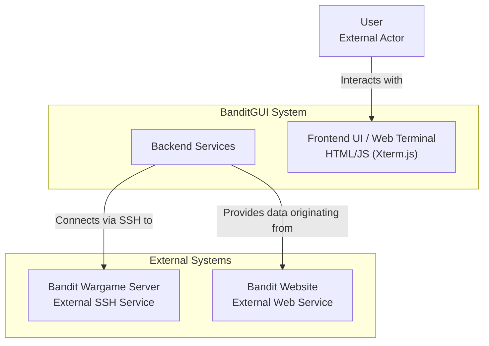

# System Context

## I am working on a software system with the following directory structure, architecture, and analyzed files

## Directory Structure

```
├── .DEV_NOTES
│   ├── ARCHIVE
│   │   └── .mcp-servers
│   │       ├── ._DEV_NOTES
│   │       │   └── SUMMARY-mcp-server-filesystem.md
│   │       ├── .gitignore
│   │       ├── README.md
│   │       ├── docs
│   │       │   └── v0.1-Final-review.md
│   │       ├── mcp_demo_filesystem.py
│   │       ├── mcp_filesystem_server.py
│   │       └── test_mcp_filesystem_simple.py
│   └── MCP-Python-SDK
│       └── python-sdk-main
│           ├── .git-blame-ignore-revs
│           ├── .github
│           │   ├── ISSUE_TEMPLATE
│           │   │   ├── bug_report.md
│           │   │   └── feature_request.md
│           │   └── workflows
│           │       ├── check-lock.yml
│           │       ├── main-checks.yml
│           │       ├── publish-docs-manually.yml
│           │       ├── publish-pypi.yml
│           │       ├── pull-request-checks.yml
│           │       └── shared.yml
│           ├── .gitignore
│           ├── .pre-commit-config.yaml
│           ├── CLAUDE.md
│           ├── CODE_OF_CONDUCT.md
│           ├── CONTRIBUTING.md
│           ├── README.md
│           ├── RELEASE.md
│           ├── SECURITY.md
│           ├── docs
│           │   ├── api.md
│           │   └── index.md
│           ├── examples
│           │   ├── README.md
│           │   ├── clients
│           │   │   └── simple-chatbot
│           │   │       ├── .python-version
│           │   │       ├── README.MD
│           │   │       ├── mcp_simple_chatbot
│           │   │       │   ├── .env.example
│           │   │       │   ├── requirements.txt
│           │   │       │   ├── servers_config.json
│           │   │       │   └── test.db
│           │   │       ├── pyproject.toml
│           │   │       └── uv.lock
│           │   └── servers
│           │       ├── simple-prompt
│           │       │   ├── .python-version
│           │       │   ├── README.md
│           │       │   └── pyproject.toml
│           │       ├── simple-resource
│           │       │   ├── .python-version
│           │       │   ├── README.md
│           │       │   └── pyproject.toml
│           │       └── simple-tool
│           │           ├── .python-version
│           │           ├── README.md
│           │           └── pyproject.toml
│           ├── mkdocs.yml
│           ├── pyproject.toml
│           ├── src
│           │   └── mcp
│           │       └── py.typed
│           └── uv.lock
├── .gitignore
├── INSTALL.md
├── OVERVIEW.md
├── README.md
├── banditgui
│   ├── data
│   │   ├── README.md
│   │   ├── all_data.json
│   │   ├── commands_data.json
│   │   ├── general_info.json
│   │   ├── levels_info.json
│   │   └── tldr-pages-book.pdf
│   ├── static
│   │   ├── bandit-terminal.css
│   │   ├── js
│   │   │   ├── bandit-app.js
│   │   │   ├── bandit-terminal.js
│   │   │   ├── xterm-addon-fit.js
│   │   │   ├── xterm-addon-web-links.js
│   │   │   ├── xterm-bandit-terminal.js
│   │   │   └── xterm.js
│   │   ├── xterm-custom.css
│   │   └── xterm.css
│   └── templates
│       └── index.html
├── docs
│   ├── assets
│   │   ├── need_a_hand.gif
│   │   ├── v0.1-Diagram-full.jpg
│   │   ├── v0.1-Diagram-min.jpg
│   │   ├── v0.2-FINAL-Components-full-dev.jpg
│   │   ├── v0.2-FINAL-Components-min-dev.jpg
│   │   ├── v0.2-screenshot.jpg
│   │   └── v0.3-screenshot.jpg
│   ├── promo
│   │   ├── blog.md
│   │   ├── notion_update.md
│   │   ├── presentation.md
│   │   └── short.md
│   ├── v0.1-Prototype.md
│   ├── v0.2-Detailled-Overview.drawio
│   ├── v0.2-FINAL-Components-dev.md
│   ├── v0.2-FINAL-Overview.md
│   ├── v0.3-Detailled-Overview.drawio
│   └── v0.3-Overview.md
├── install.bat
├── install.sh
├── package.json
├── requirements.txt
├── run.sh
├── static
│   ├── js
│   │   ├── xterm-addon-fit.js
│   │   ├── xterm-addon-web-links.js
│   │   └── xterm.js
│   └── xterm.css
└── v0.3-context.md

```

## Mermaid Diagram



## Analyzed Files
